# ClipIt Architecture

This document provides comprehensive architecture diagrams for the ClipIt Windows clipboard manager.

## System Overview

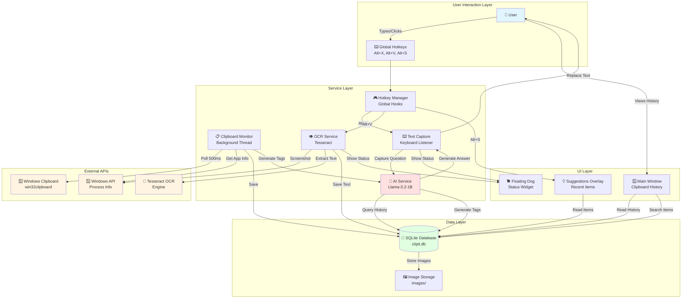

## Component Architecture

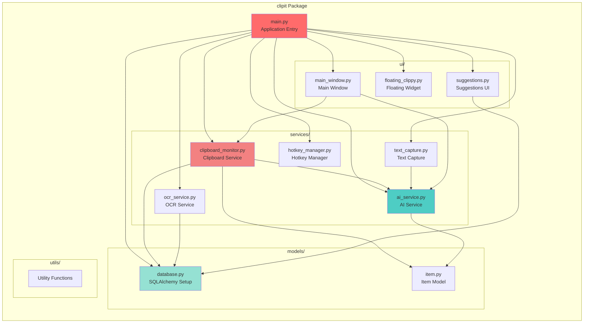

## Data Flow - Text Capture & AI Answer

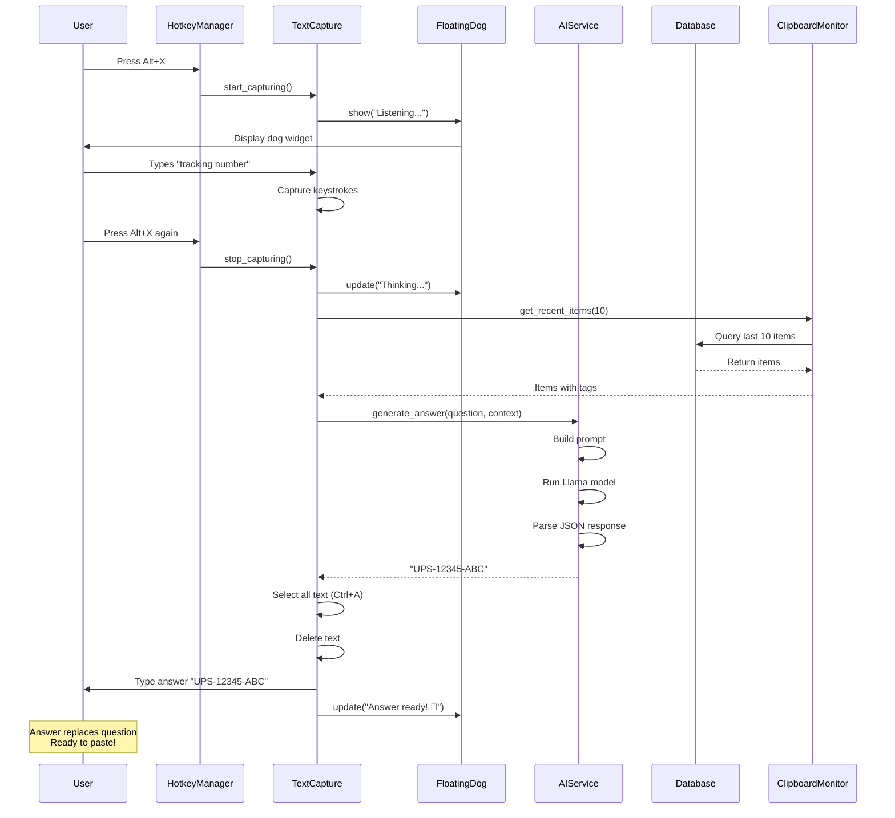

## Data Flow - Clipboard Monitoring

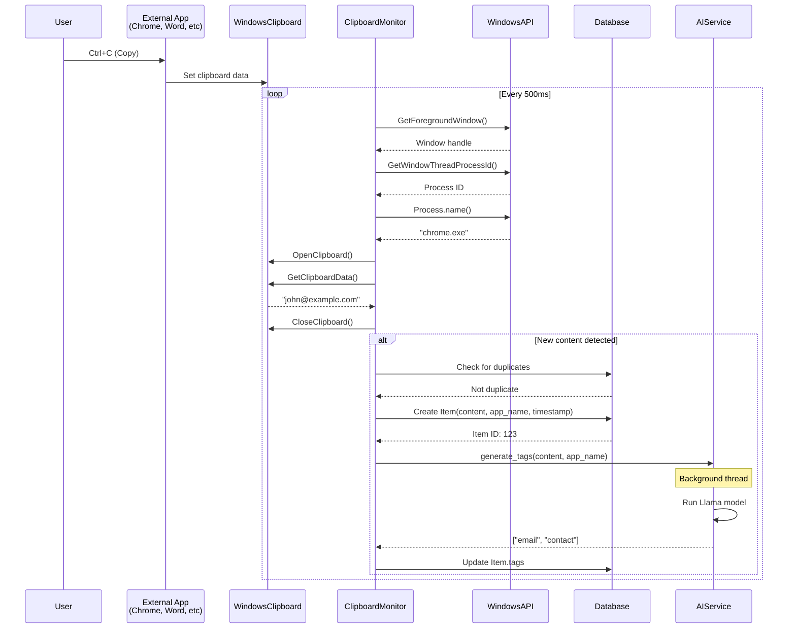

## Database Schema

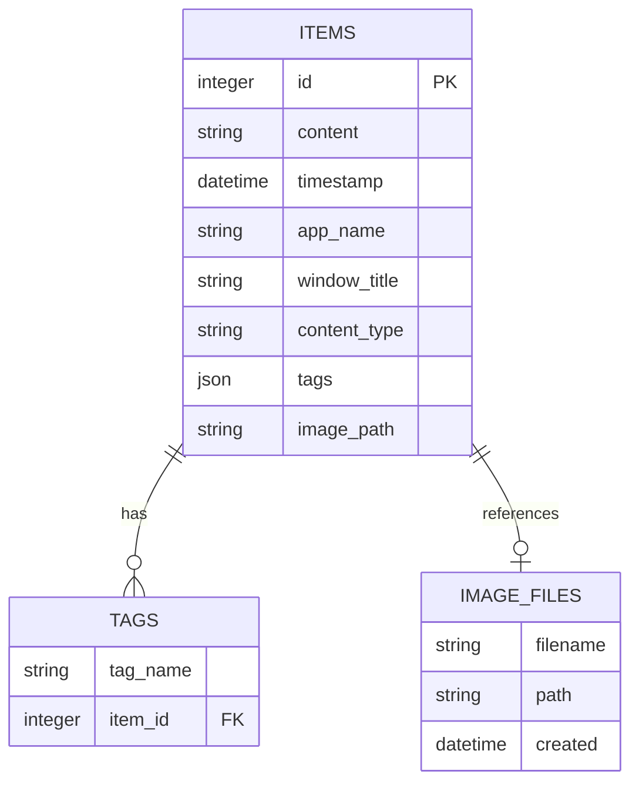

## State Machine - Text Capture

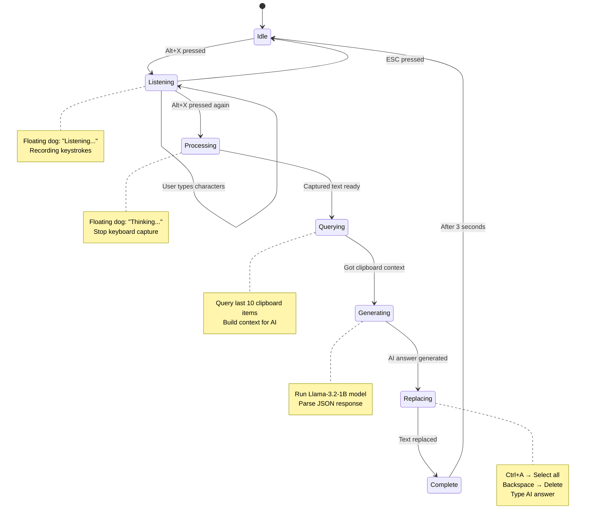

## Thread Architecture

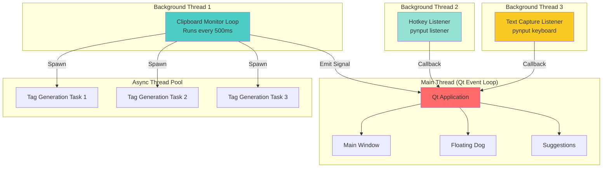

## Technology Stack Layers

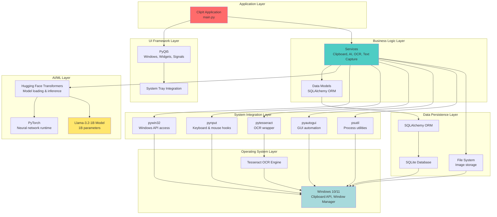

## Deployment View

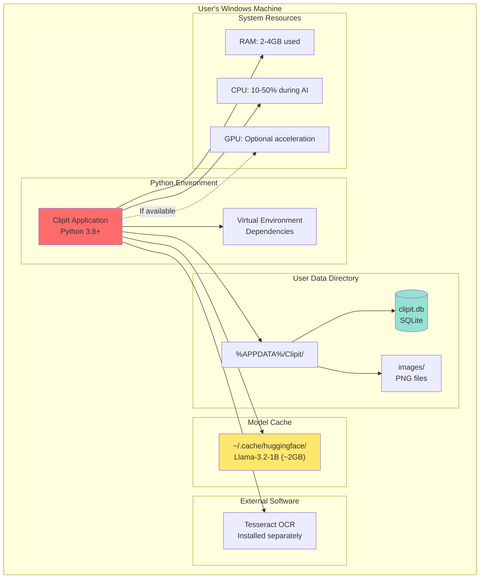

## File Structure

```
PastePup/
├── clipit/                          # Main application package
│   ├── __init__.py                 # Package initializer
│   ├── main.py                     # Application entry point & orchestration
│   │
│   ├── models/                     # Data layer
│   │   ├── __init__.py
│   │   ├── database.py            # SQLAlchemy setup & session management
│   │   └── item.py                # Item model (clipboard entries)
│   │
│   ├── services/                   # Business logic layer
│   │   ├── __init__.py
│   │   ├── clipboard_monitor.py   # Background clipboard monitoring
│   │   ├── ai_service.py          # Llama AI integration
│   │   ├── text_capture.py        # Keyboard capture & text replacement
│   │   ├── ocr_service.py         # Tesseract OCR integration
│   │   └── hotkey_manager.py      # Global hotkey hooks
│   │
│   ├── ui/                         # Presentation layer
│   │   ├── __init__.py
│   │   ├── main_window.py         # Main application window (PyQt5)
│   │   ├── floating_clippy.py     # Floating status widget
│   │   └── suggestions.py         # Suggestions overlay
│   │
│   └── utils/                      # Utilities
│       └── __init__.py
│
├── requirements.txt                # Python dependencies
├── test_clipit.py                 # Test suite
├── run.bat                        # Windows launcher script
│
├── README.md                      # User documentation
├── ARCHITECTURE.md                # This file
├── INSTALL.md                     # Installation guide
├── TESTING.md                     # Testing procedures
├── TROUBLESHOOTING.md            # Common issues
├── STATUS.md                      # Project status
└── MIGRATION_SUMMARY.md          # Migration history
```

## Key Design Patterns

### 1. Observer Pattern
- **Where**: Clipboard monitoring
- **How**: Background thread continuously polls clipboard, notifies when changes detected

### 2. Service Layer Pattern
- **Where**: All business logic in `services/`
- **How**: Separation of concerns - UI, business logic, and data layers are independent

### 3. Repository Pattern
- **Where**: Database access through SQLAlchemy
- **How**: Abstract data access, easy to swap database implementations

### 4. Facade Pattern
- **Where**: AIService wraps complex Transformers/PyTorch APIs
- **How**: Simple interface (`generate_answer()`, `generate_tags()`) hides complexity

### 5. Strategy Pattern
- **Where**: AI model selection (can swap Llama for other models)
- **How**: Model name configurable, same interface for all models

### 6. Signal-Slot Pattern
- **Where**: PyQt5 UI updates
- **How**: Asynchronous communication between threads and UI

## Performance Considerations

### Memory Usage
```
Idle State:           ~200 MB
Model Loaded:         ~2 GB
Active Processing:    ~2.5 GB
Peak (with GPU):      ~3 GB
```

### Timing Metrics
```
Clipboard Check:      <1 ms (every 500ms)
Database Save:        5-10 ms
Tag Generation:       1-3 seconds (async)
AI Answer:            1-3 seconds (CPU), <1s (GPU)
OCR Processing:       1-3 seconds
Text Replacement:     <100 ms
```

### Threading Model
- **Main Thread**: Qt event loop (UI updates)
- **Background Thread 1**: Clipboard monitoring (continuous)
- **Background Thread 2**: Hotkey listener (event-driven)
- **Background Thread 3**: Text capture (when active)
- **Thread Pool**: AI tag generation (spawned per item)

## Security Architecture

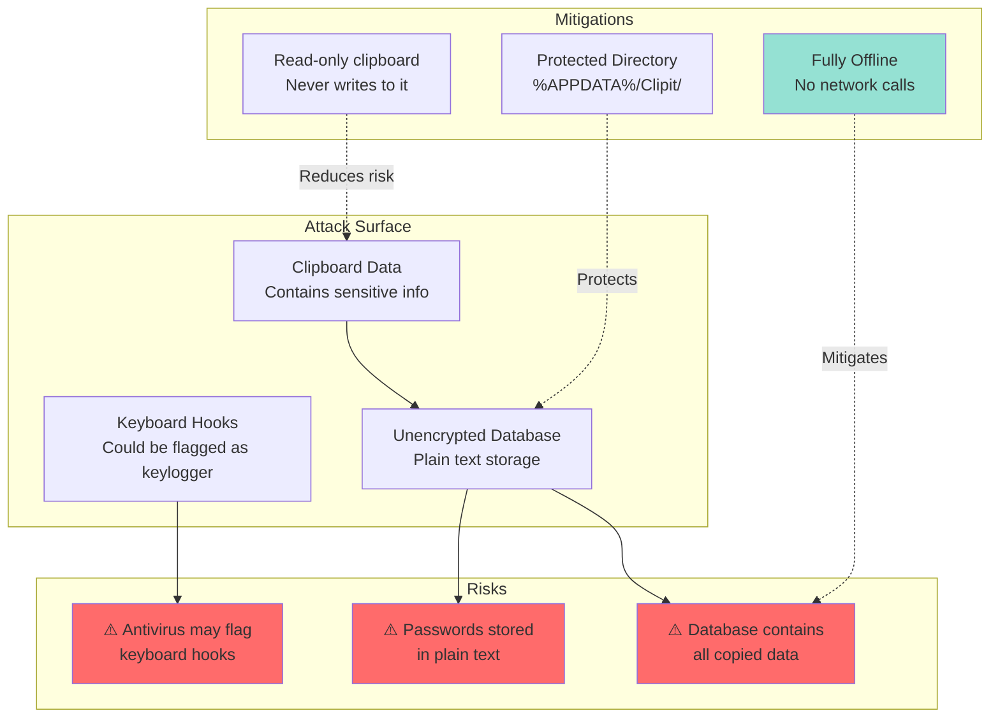

## Future Enhancements

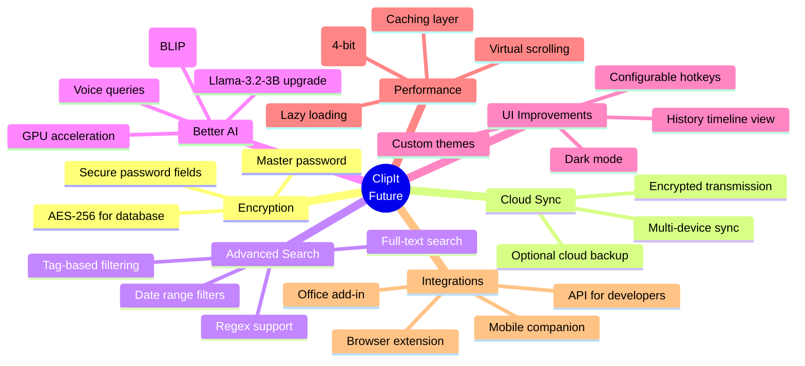

## Monitoring & Logging

Current logging strategy:
```python
# All components log to console
print("✅ Success message")
print("⚠️ Warning message")
print("❌ Error message")
print("🚀 Startup message")
print("📋 Clipboard activity")
print("🤖 AI activity")
```

Recommended production logging:
```python
import logging

logging.basicConfig(
    level=logging.INFO,
    format='%(asctime)s - %(name)s - %(levelname)s - %(message)s',
    handlers=[
        logging.FileHandler('%APPDATA%/Clipit/clipit.log'),
        logging.StreamHandler()
    ]
)
```

---

## Useful Commands

### Generate visual diagram from Mermaid:
```bash
# Install mermaid-cli
npm install -g @mermaid-js/mermaid-cli

# Generate PNG
mmdc -i ARCHITECTURE.md -o architecture.png

# Generate SVG
mmdc -i ARCHITECTURE.md -o architecture.svg
```

### Analyze code structure:
```bash
# Line counts
find clipit -name "*.py" | xargs wc -l

# Dependency graph
pydeps clipit --max-bacon=2 -o dependencies.svg
```

### Profile performance:
```bash
# Memory profiling
python -m memory_profiler clipit/main.py

# CPU profiling
python -m cProfile -o profile.stats clipit/main.py
```

---

**Last Updated**: 2025-11-16  
**Version**: 1.0  
**Author**: ClipIt Team

